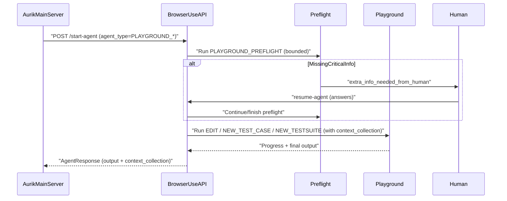
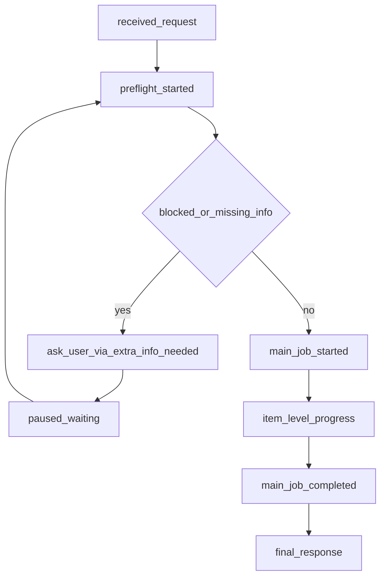

# Playground Preflight (DETAILED)

## Scope
This doc defines a **logic-level upgrade** inside `browser-use-agent`:
- `aurik main server` keeps deciding job type and calling `/start-agent`
- `browser-use-agent` always runs a **browser-based Preflight/Discovery stage** first
- then runs one of the playground agents:
  - `EDIT_TEST_CASE_PLAYGROUND_AGENT`
  - `NEW_TEST_CASE_PLAYGROUND_AGENT`
  - `NEW_TESTSUITE_PLAYGROUND_AGENT`

Goal: **find what was missed**, discover new flows/boundary cases, and detect app changes that require testcase edits.

## Key idea
Make `browser-use-agent` own the “understand the app/job” work:
- Preflight = browse + validate + collect + ask
- Main job = edit/create suite/cases with grounded context

## Runtime sequence

## Always-on state machine

## Preflight (what it must do)
Preflight is **not** “more prompting”. It is a **tool-call first** stage that uses the browser to ground the job.

### Preflight objectives (strict)
1. **Resolve base URL** even when provided `project_base_url` is missing/wrong.
2. **Reach stable app state** (login, tenant/workspace, role, feature flags).
3. **Build a minimal UI map** (top nav + key pages + how to reach).
4. **Find/validate entry points** relevant to the request.
5. **Detect changes** (routes/components moved, missing buttons/forms).
6. **Detect gaps** (missing boundary/negative/roles/state transitions).
7. **Ask only critical missing info** and pause/resume cleanly.

### Preflight tool-call pattern (recommended)
Use a consistent “fast smoke validation” loop before main job:
- Open candidate base URL
- Verify logged-in state (or detect login wall)
- Navigate to each candidate entry point
- Verify that key UI exists (page title / main header / primary CTA)
- Record evidence (visited URLs + short notes)

## `context_collection` (recommended output contract)
Make preflight output a single structured object that is passed into the main agent and returned to backend:

### Shape
- `resolved_base_url: string`
- `auth_state`:
  - `requires_login: boolean`
  - `blockers: string[]`
  - `hints: string`
- `environment`:
  - `tenant: string | null`
  - `workspace: string | null`
  - `role: string | null`
  - `feature_flags: string[]`
- `candidate_entry_points: { label: string, url?: string, click_path?: string, confidence: number }[]`
- `ui_map`:
  - `top_nav: string[]`
  - `key_pages: { name: string, url?: string, how_to_reach: string }[]`
- `discovered_flows_summary: { flow_name: string, entry_point: string, notes: string }[]`
- `detected_changes: { type: string, evidence: string, impacted_testcase_ids?: string[] }[]`
- `coverage_gaps: { gap_type: string, suggestion: string }[]`
- `questions: { title: string, question: string, info_needed: string[], options?: string[] }[]`
- `answers: { key: string, value: string }[]`
- `confidence: { base_url: number, entry_points: number, coverage: number }`
- `evidence: { visited_urls: string[], notes: string[] }`

### Passing rules
- Preflight writes `context_collection`
- Main job receives it and must:
  - reuse `resolved_base_url` for navigation
  - reuse `candidate_entry_points` (don’t guess again)
  - treat `detected_changes` as “edit priority”
  - treat `coverage_gaps` as “create priority”

## How preflight improves each playground agent

### 1) EDIT_TEST_CASE_PLAYGROUND_AGENT
Problem this fixes:
- entry points stale after UI change
- edits done “blind” without confirming current UI

Preflight adds:
- validated entry points per selected testcase
- `detected_changes + impacted_testcase_ids`
- “cannot proceed” early (login/role mismatch)

Main agent behavior:
- edit only selected cases
- item-by-item progress updates
- include per-case before/after summary

### 2) NEW_TEST_CASE_PLAYGROUND_AGENT
Problem this fixes:
- duplicates
- generic cases not grounded in actual app behavior
- missing boundary/negative/role coverage

Preflight adds:
- confirmed screen/flow context for the requested “area”
- gap list (boundary/negative/state/permissions)
- stable navigation steps (“how_to_reach”)

Main agent behavior:
- generate cases only within the scoped area
- de-duplicate against provided existing cases
- fill gaps first, then “nice-to-have” cases

### 3) NEW_TESTSUITE_PLAYGROUND_AGENT
Problem this fixes:
- no entry point; suite scope ambiguous
- suite duplicates existing coverage

Preflight adds:
- module map (major flows) from real UI
- proposes 2–5 suite candidates and asks user to choose/confirm
- highlights uncovered modules vs existing suites (if provided)

Main agent behavior:
- create suite(s) only for uncovered areas
- immediately invoke `NEW_TEST_CASE_PLAYGROUND_AGENT` to populate

## What to ask the user (only critical)
Use `extra_info_needed_from_human` when any of these blocks progress:
- base URL unknown / multiple candidates
- login method/credentials required
- tenant/workspace selection required
- required role unknown (403/hidden navigation)
- NEW_TESTSUITE scope unclear (“which module?”)

### Ask style
- Prefer multiple-choice options when possible (detected modules/base URLs)
- Ask 1–2 questions max per pause
- Store answers in `context_collection.answers`

## Change detection (for “user changed the app”)
Preflight should proactively detect and report changes that cause stale testcases:
- entry point URLs redirect/404
- key CTA/button no longer exists
- form fields changed (name/type/required)
- permission gating changed (403/hidden)

Output:
- `detected_changes[]` with short evidence
- include `impacted_testcase_ids` when selected cases are provided

Main job usage:
- EDIT agent updates only impacted cases (and leaves the rest untouched)

## Coverage gap heuristics (rule-based, not LLM-only)
When creating new cases, always consider these categories:
- validation: empty/invalid/max length/special chars
- permissions: role-based access, hidden actions
- state transitions: create/edit/delete, undo/cancel
- concurrency: double-submit, refresh mid-flow
- search/filter/sort/pagination
- error states: network failure, server errors, timeouts
- file upload (if present): size/type limits

## Extra improvement ideas (beyond preflight)
1. **Confidence-gated escalation**: if `confidence.entry_points` is low, pause and ask user rather than guessing.
2. **Selector healing**: when entry points fail, generate 2–3 alternative click-paths and mark old ones stale.
3. **Two-pass generation**: propose titles first, expand after quick approval (or auto-approve if user is silent).
4. **Session caching**: reuse `ui_map` and `resolved_base_url` across jobs until navigation fails.
5. **Budget control**: cap preflight steps/time; stop early once confidence is high.
6. **Evidence for audit**: store visited URLs + short notes in `evidence` so debugging is easy.
7. **Fast “smoke replay” mode**: validate a small subset of existing cases to identify what broke after app changes.

## Minimal WebSocket event naming (recommended)
Emit these updates (high signal, stable):
- `preflight_started`
- `preflight_progress`
- `preflight_question`
- `preflight_completed`
- `main_job_started`
- `item_progress`
- `main_job_completed`

